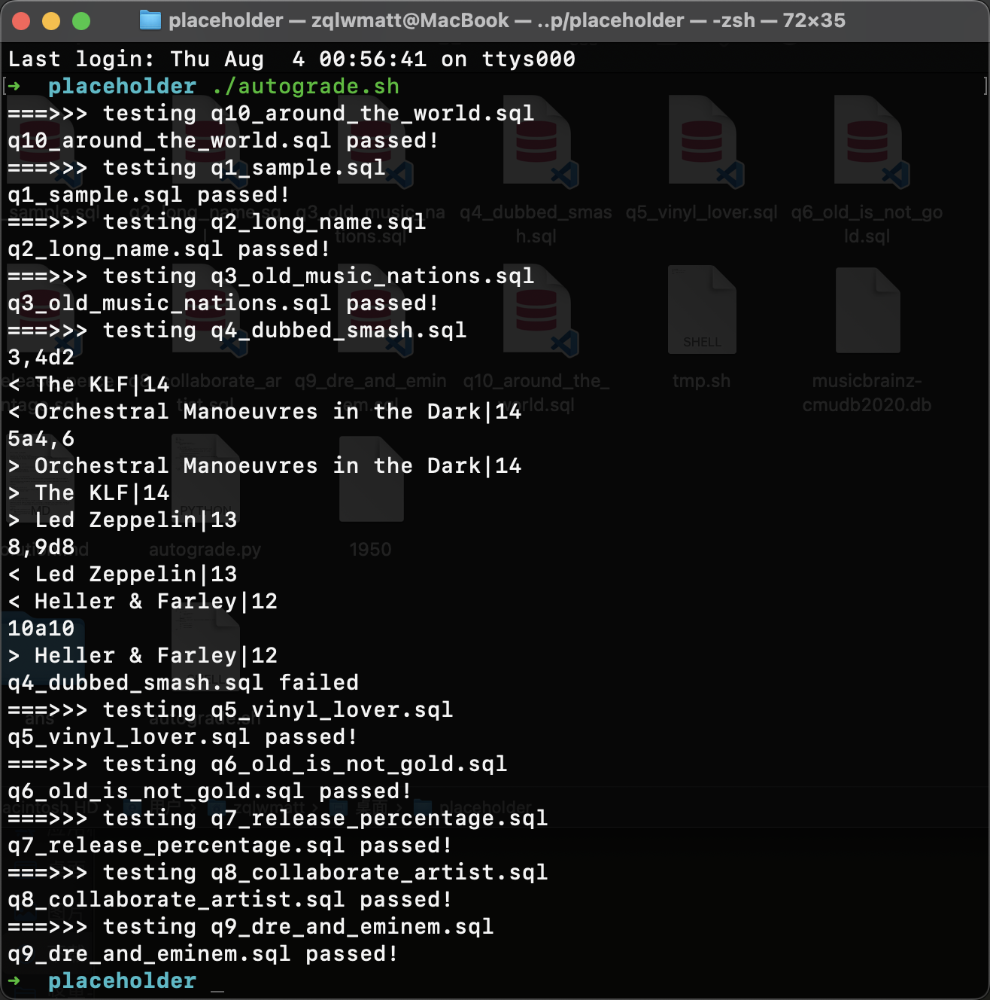

## Q1 [0 POINTS] (Q1_SAMPLE):

The purpose of this query is to make sure that the formatting of your output matches exactly the formatting of our auto-grading script.

**Details:** List all types of work ordered by type ascendingly.

**Answer**: Here's the correct SQL query:

```sqlite
select name from work_type order by name;
```


## Q2 [5 POINTS] (Q2_LONG_NAME):

List works with longest name of each type.

**Details:** For each work type, find works that have the longest names. There might be cases where there is a tie for the longest names - in that case, return all of them. Display work names and corresponding type names, and order it according to work type (ascending) and use work name (ascending) as tie-breaker.

**Answer**: 

```sqlite
SELECT work.name, work_type.name
FROM work
	INNER JOIN (
        SELECT work.id as id, work.type as type, max(length(work.name)) as max_len
        FROM work
        GROUP BY type
    ) AS temp ON work.id = temp.id
    INNER JOIN work_type ON work.type = work_type.id
ORDER BY work.type ASC, work.name ASC;
```


## Q3 [5 POINTS] (Q3_OLD_MUSIC_NATIONS):

List top 10 countries with the most classical music artists (born or started before 1850) along with the number of associated artists.

**Details:** Print country and number of associated arists before 1850. For example, `Russia|191`. Sort by number of artists in descending order.

**Answer**: 

```sqlite
SELECT area.name, count(*) as cnt
FROM artist
	INNER JOIN area ON artist.area = area.id -- 去重
where artist.begin_date_year < 1850
GROUP BY area.name
ORDER BY cnt DESC
LIMIT 10;
```


## Q4 [10 POINTS] (Q4_DUBBED_SMASH):

List the top 10 dubbed artist names with the number of dubs.

**Details:** Count the number of distinct names in `artist_alias` for each artist in the `artist` table, and list only the top ten who's from the United Kingdom and started after 1950 (not included). Print the artist name in the `artist` table and the number of corresponding distinct dubbed artist names in the `artist_alias` table.

**Answer**: 

```sqlite
SELECT artist.name, count(distinct alias.name) as cnt
FROM artist
	INNER JOIN area ON area.id = artist.area
	INNER JOIN artist_alias AS alias ON alias.artist = artist.id
WHERE area.name = 'United Kingdom' AND artist.begin_date_year > 1950
GROUP BY artist.name
ORDER BY cnt DESC
LIMIT 10;
```


## Q5 [10 POINTS] (Q5_VINYL_LOVER):

List the distinct names of releases issued in vinyl format by the British band Coldplay.

**Details:** Vinyl format includes ALL vinyl dimensions excluding `VinylDisc`. Sort the release names by release date ascendingly.

**Answer**:

First we select the vinyl format from the name of medium_format, and we can conclude that all the feasible format likes "%Vinyl".

```sqlite
sqlite> select name from medium_format where name like '%Vinyl%';
7" Vinyl
10" Vinyl
12" Vinyl
VinylDisc
Vinyl
VinylDisc (DVD side)
VinylDisc (Vinyl side)
VinylDisc (CD side)
```

```sqlite
SELECT distinct release.name
FROM release
	INNER JOIN medium ON medium.release = release.id
	INNER JOIN medium_format AS format ON medium.format = format.id
	INNER JOIN artist_credit AS credit ON credit.id = release.artist_credit
	INNER JOIN artist_credit_name AS credit_name ON credit_name.artist_credit = credit.id
	INNER JOIN artist ON credit_name.artist = artist.id
	INNER JOIN release_info AS info ON info.release = release.id
WHERE format.name like '%Vinyl' AND artist.name = 'Coldplay'
ORDER BY info.date_year, info.date_month, info.date_day;
```

==The problem description of Vinyl format is vague in a way.==


## Q6 [10 POINTS] (Q6_OLD_IS_NOT_GOLD):

Which decades saw the most number of official releases? List the number of official releases in every decade since 1900. Like `1970s|57210`.

**Details:** Print all decades and the number of official releases. Releases with different issue dates or countries are considered different releases. Print the relevant decade in a fancier format by constructing a string that looks like this: `1970s`. Sort the decades in decreasing order with respect to the number of official releases and use decade (descending) as tie-breaker. Remember to exclude releases whose dates are `NULL`.

**Answer**: 

```sqlite
select (cast((date_year / 10) as int) * 10) || 's' as decade, count(*) as cnt
from release
	inner join release_info info on release.id = info.release
where date_year >= 1900 and status = 1
group by decade
order by cnt desc;
```


## Q7 [15 POINTS] (Q7_RELEASE_PERCENTAGE):

List the month and the percentage of all releases issued in the corresponding month all over the world in the past year. Display like `2020.01|5.95`.

**Details:** The percentage of releases for a month is the number of releases issued in that month devided by the total releases in the past year from 07/2019 to 07/2020, both included. Releases with different issue dates or countries are considered different releases. Round the percentage to two decimal places using `ROUND()`. Sort by dates in ascending order.

**Answer**:

```sqlite
select date, round(cnt*100.0/cnt_sum, 2)
from(
    select date, cnt, sum(cnt) over () as cnt_sum
    from
        (select date_year || '.' ||
                case when date_month < 10 then '0' else '' end ||
                date_month as date, count(*) as cnt
        from release
            inner join release_info info on release.id = info.release
        where (date_year = 2019 and date_month >= 7) or 
            (date_year = 2020 and date_month <= 7)
        group by date_year, date_month
        order by date asc));
```


## Q8 [15 POINTS] (Q8_COLLABORATE_ARTIST):

List the number of artists who have collaborated with Ariana Grande.

**Details:** Print only the total number of artists. An artist is considered a collaborator if they appear in the same artist_credit with Ariana Grande. The answer should include Ariana Grande herself.

**Answer**:

```sqlite
select count(distinct artist)
from artist_credit_name
where artist_credit in (
    select artist_credit from artist_credit_name
    where name = 'Ariana Grande' -- 把 Ariana Grande 的全部作品名拉出来
);
```

==It will be troublesome if you do not know the meaning of `artist_credit_name` table.==


## Q9 [15 POINTS] (Q9_DRE_AND_EMINEM):

List the rank, artist names, along with the number of collaborative releases of Dr. Dre and Eminem among other most productive duos (as long as they appear in the same release) both started after 1960 (not included). Display like `[rank]|Dr. Dre|Eminem|[# of releases]`.

**Details:** For example, if you see a release by A, B, and C, it will contribute to three pairs of duos: `A|B|1`, `A|C|1`, and `B|C|1`. You will first need to calculate a rank of these duos by number of collaborated releases (release with artist_credit shared by both artists) sorted descendingly, and then find the rank of `Dr. Dre` and `Eminem`. Only releases in English are considered. Both artists should be solo artists. All pairs of names should have the alphabetically smaller one first. Use artist names (asc) as tie breaker.

**Hint:** Artist aliases may be used everywhere. When doing aggregation, using artist ids will ensure you get the correct results. One example entry in the rank list is `9|Benj Pasek|Justin Paul|27`

**Answer**:

**Hint 1:** The problem says both artists should be solo artists, which means the `artist_type` of a artist should be `Person`.

```sqlite
sqlite> select * from artist_type;
5|Orchestra
6|Choir
2|Group
1|Person
4|Character
3|Other
```

**Hint 2:** We are requiered to assign pairs (artist1, artist2) as a attribute. To avoid the trouble made by pairs like (artist2, artist1), this attribute need to be well-ordered. (e.g. artist1.name < artist2.name)

**Hint 3:** The sort rule is not default. So the `rank()` function cannot work and we need to custom a new sort function with `row_number()`.

```sqlite
with duos_list (id1, id2, count) as (
    select a1.artist as id1,
        a2.artist as id2,
        count(*) as c
    from artist_credit_name a1
        inner join artist_credit_name a2 on a1.artist_credit = a2.artist_credit
        inner join release r on a2.artist_credit = r.artist_credit
        inner join artist a3 on a1.artist = a3.id
        inner join artist a4 on a2.artist = a4.id
        inner join artist_type a5 on a3.type = a5.id
        inner join artist_type a6 on a4.type = a6.id
        inner join language l on r.language = l.id
    where a3.name < a4.name
        and a5.name = "Person"
        and a6.name = "Person"
        and l.name = 'English'
        and a3.begin_date_year > 1960
        and a4.begin_date_year > 1960
    group by a1.artist,
        a2.artist
)
select *
from (
        select row_number () over (
                order by count desc,
                    a1.name,
                    a2.name
            ) as rank,
            a1.name as name1,
            a2.name as name2,
            count
        from duos_list d
            inner join artist a1 on d.id1 = a1.id
            inner join artist a2 on d.id2 = a2.id
    )
where name1 = 'Dr. Dre'
    and name2 = 'Eminem';
```


## Q10 [15 POINTS] (Q10_AROUND_THE_WORLD):

Concat all dubbed names of The Beatles using comma-separated values(like "`Beetles, fab four`").

**Details:** Find all dubbed names of artist "`The Beatles`" in artist_alias and order them by id (ascending). Print a single string containing all the dubbed names separated by commas.

**Hint:** You might find [CTEs](https://sqlite.org/lang_with.html) useful.

**Answer**: 

```sqlite
with recursive t1 (num, name) as (
	select row_number() over (order by alias.id asc), alias.name
	from artist
		inner join artist_alias as alias on artist.id = alias.artist
	where artist.name = "The Beatles"
	order by alias.id
),
t2 (num, name) as (
	select num, name from t1 where num = 1 -- initialize
	union all
	select t1.num, t2.name || ',' || t1.name from t1, t2 where t1.num = t2.num + 1
)
select name from t2 order by num desc limit 1;
```


The autograde result is attached. **Remark: the solution of q4 is not unique.**


