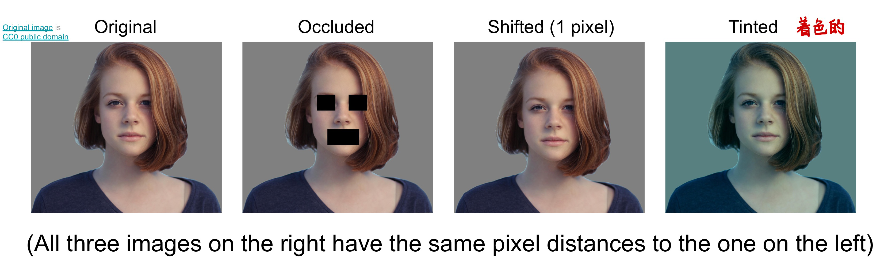
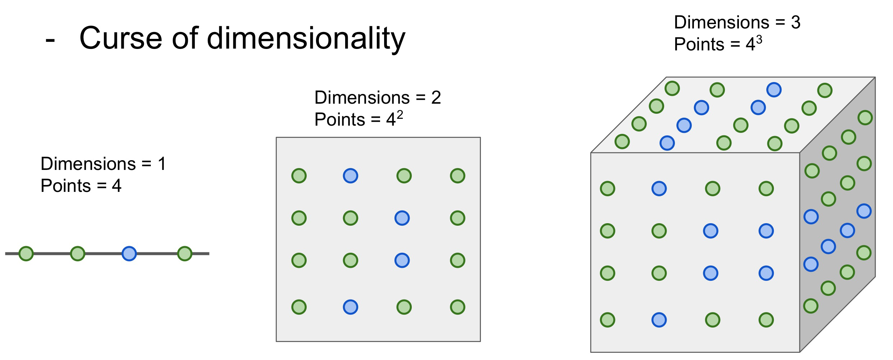
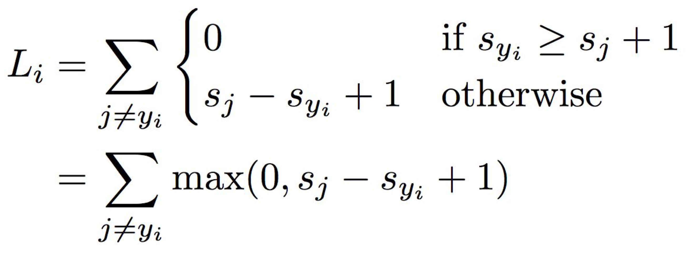
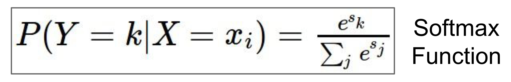
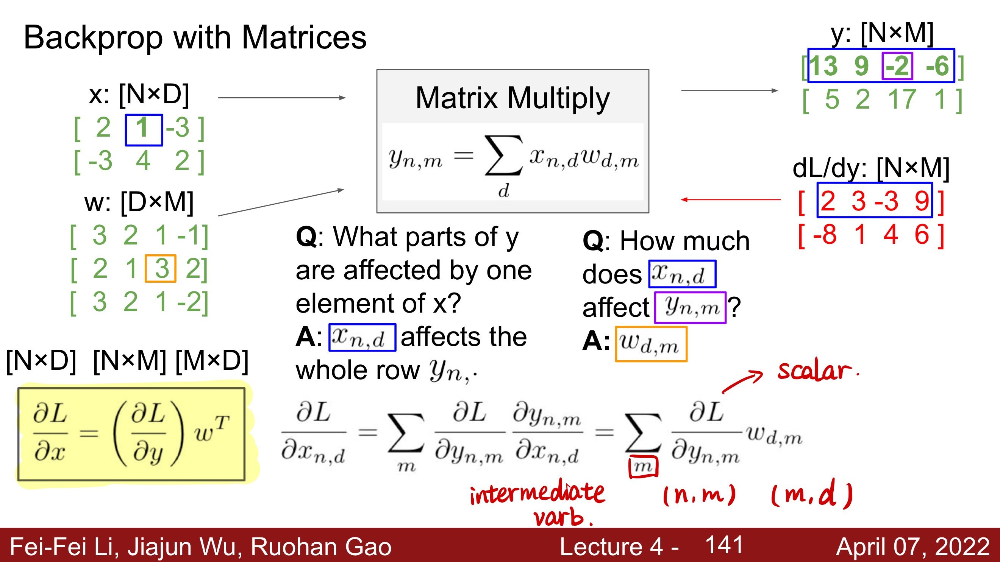

[TOC]

---

## Learning objective

- Understand the basic **Image Classification pipeline** and the data-driven approach (train/predict stages).
- Understand the train/val/test **splits** and the use of validation data for **hyperparameter tuning**.
- Develop proficiency in writing efficient **vectorized** code with numpy.
- Implement and apply a k-Nearest Neighbor (**kNN**) classifier.
- Implement and apply a Multiclass Support Vector Machine (**SVM**) classifier.
- Implement and apply a **Softmax** classifier.
- Implement and apply a **Two layer neural network** classifier.
- Understand the differences and tradeoffs between these classifiers.
- Get a basic understanding of performance improvements from using **higher-level representations** as opposed to raw pixels, e.g. color histograms, Histogram of Oriented Gradient (HOG) features, etc.


## Q1: k-Nearest Neighbor classifier

### Implement

```python
   def compute_distances_two_loops(self, X):
        """
        Compute the distance between each test point in X and each training point
        in self.X_train using a nested loop over both the training data and the
        test data.

        Inputs:
        - X: A numpy array of shape (num_test, D) containing test data.

        Returns:
        - dists: A numpy array of shape (num_test, num_train) where dists[i, j]
          is the Euclidean distance between the ith test point and the jth training
          point.
        """
        num_test = X.shape[0]
        num_train = self.X_train.shape[0]
        dists = np.zeros((num_test, num_train))
        for i in range(num_test):
            for j in range(num_train):
                # *****START OF YOUR CODE (DO NOT DELETE/MODIFY THIS LINE)*****

                dists[i, j] = np.sqrt(np.sum((X[i]-self.X_train[j]) ** 2))
                
                # *****END OF YOUR CODE (DO NOT DELETE/MODIFY THIS LINE)*****
        return dists

    def compute_distances_one_loop(self, X):
        num_test = X.shape[0]
        num_train = self.X_train.shape[0]
        dists = np.zeros((num_test, num_train))
        for i in range(num_test):
            # *****START OF YOUR CODE (DO NOT DELETE/MODIFY THIS LINE)*****
            
            dists[i, :] = np.sqrt(np.sum((X[i] - self.X_train) ** 2, axis = 1))

            # *****END OF YOUR CODE (DO NOT DELETE/MODIFY THIS LINE)*****
        return dists

    def compute_distances_no_loops(self, X):
        num_test = X.shape[0]
        num_train = self.X_train.shape[0]
        dists = np.zeros((num_test, num_train))
        # *****START OF YOUR CODE (DO NOT DELETE/MODIFY THIS LINE)*****

        dists += np.sum(self.X_train ** 2, axis=1).reshape(1, num_train)
        dists += np.sum(X ** 2, axis=1).reshape(num_test, 1) # reshape for broadcasting
        dists -= 2 * X.dot(self.X_train.T)
        dists = np.sqrt(dists)

        # *****END OF YOUR CODE (DO NOT DELETE/MODIFY THIS LINE)*****
        return dists
```

**Remark:** $dist_{i} = (x - x_{train})^2 = x^2 + x_{train}^2 - 2 x \cdot x_{train}$ （dot product term by term）

> **Time cost:**
>
> Two loop version took 38.509685 seconds 
>
> One loop version took 27.387717 seconds 
>
> No loop version took 0.568043 seconds

**k-fold cross verification:** `np.array_split(np_array, num)`

```python
>>> np.array_split(a, 5)
[array([0, 1]), array([2, 3]), array([4, 5]), array([6, 7]), array([8, 9])]
```

strategy: we test different **hyperparameters** $k$ in the list by cross verification, and determine the best $k$ whose predict accuracy is highest.

```python
num_folds = 5
k_choices = [1, 3, 5, 8, 10, 12, 15, 20, 50, 100]

X_train_folds = []
y_train_folds = []
# *****START OF YOUR CODE (DO NOT DELETE/MODIFY THIS LINE)*****

X_train_folds = np.array(np.array_split(X_train, num_folds))
y_train_folds = np.array(np.array_split(y_train, num_folds))

# *****END OF YOUR CODE (DO NOT DELETE/MODIFY THIS LINE)*****

# A dictionary holding the accuracies for different values of k that we find
# when running cross-validation. After running cross-validation,
# k_to_accuracies[k] should be a list of length num_folds giving the different
# accuracy values that we found when using that value of k.
k_to_accuracies = {}


# *****START OF YOUR CODE (DO NOT DELETE/MODIFY THIS LINE)*****

for k in k_choices:
    accuracies = []
    for cnt in range(num_folds): # exclude this training set
        classifier = KNearestNeighbor()
        X_train_cv = np.vstack((X_train_folds[0: cnt], X_train_folds[cnt+1: num_folds])).reshape((-1, X_train.shape[1]))
        y_train_cv = np.append(y_train_folds[0: cnt], y_train_folds[cnt+1: num_folds]) # only (N, ) 1 dimension
        classifier.train(X_train_cv, y_train_cv)

        y_test_pred = classifier.predict(X_train_folds[cnt], k)
        num_correct = np.sum(y_test_pred == y_train_folds[cnt])
        accuracy = float(num_correct) / len(y_train_folds[cnt])
        accuracies.append(accuracy)

    k_to_accuracies[k] = accuracies
```

**Correctness:** $28.0\%$

### Drawbacks of KNN






## Q2: Training a Support Vector Machine

SVM is a typical linear classifer, for any possible catalogue, **we use SVM to calculate the cost function and train the linear weight**. The esscence is to use a great linear weight to do classification.



$L = \cfrac{1}{N} \sum \limits_{i=1}^{N} L_{i}$

- **Regularization:** $L^{\prime}(W) = L(W) + \lambda R(W)$, where $\lambda$ is a hyperparameter. It means that we could use more complex polynomial at expense of higher $R(W)$.

- **Optimization:**

    - Stochastic Gradient Descent (SGD)

        

    

    

    - Learning Rate Decay: Learning rate $\alpha = \cfrac{1}{2}\alpha _{0} (1+ \cos (t\pi / T))\quad \text{or} \quad \alpha _{0} (1- t/T) \quad \text{or} \quad \alpha _{0} / \sqrt{t}$ .
    - Second-Order Optimization: **BGFS**, **L-BFGS**.

**The specifical Stochastic Gradient Descent method in SVM: (if $s_{i} - s_{y_{i}} + 1 > 0$)**
$$
{dW_{j}} = X_{i}, {dW_{y_{i}}} = - X_{i}
$$

### Implement

```python
def svm_loss_naive(W, X, y, reg):
    """
    Structured SVM loss function, naive implementation (with loops).

    Inputs have dimension D, there are C classes, and we operate on minibatches
    of N examples.

    Inputs:
    - W: A numpy array of shape (D, C) containing weights.
    - X: A numpy array of shape (N, D) containing a minibatch of data.
    - y: A numpy array of shape (N,) containing training labels; y[i] = c means
      that X[i] has label c, where 0 <= c < C.
    - reg: (float) regularization strength

    Returns a tuple of:
    - loss as single float
    - gradient with respect to weights W; an array of same shape as W
    """
    dW = np.zeros(W.shape)  # initialize the gradient as zero

    # compute the loss and the gradient
    num_classes = W.shape[1]
    num_train = X.shape[0]
    loss = 0.0
    for i in range(num_train):
        scores = X[i].dot(W)
        correct_class_score = scores[y[i]]
        for j in range(num_classes):
            if j == y[i]:
                continue
            # loss value
            margin = scores[j] - correct_class_score + 1  # note delta = 1
            if margin > 0:
                loss += margin
                dW[:, j] += X[i].T
                dW[:, y[i]] -= X[i].T 

    loss /= num_train
    dW /= num_train

    # Add regularization to the loss.
    loss += reg * np.sum(W * W)

    # *****START OF YOUR CODE (DO NOT DELETE/MODIFY THIS LINE)*****

    dW += 2 * reg * W

    # *****END OF YOUR CODE (DO NOT DELETE/MODIFY THIS LINE)*****

    return loss, dW


def svm_loss_vectorized(W, X, y, reg):
    loss = 0.0
    dW = np.zeros(W.shape)  # initialize the gradient as zero

    # *****START OF YOUR CODE (DO NOT DELETE/MODIFY THIS LINE)*****

    num_train = X.shape[0]
    
    scores = np.dot(X, W)
    idx = np.arange(num_train)
    correct_class_score = scores[idx, y].reshape((-1, 1))
    margin = scores - correct_class_score + 1
    margin[np.arange(num_train), y] = 0

    bad_cases = margin > 0
    loss += np.sum(margin[bad_cases])
    loss /= num_train
    loss += reg * np.sum(W * W)

    bad_cases = bad_cases.astype('int')
    num_wrong_classification = np.sum(bad_cases, axis = 1)
    bad_cases[np.arange(num_train), y] -= num_wrong_classification
    dW += (X.T).dot(bad_cases)
    dW /= num_train

    dW += 2 * reg * W

    # *****END OF YOUR CODE (DO NOT DELETE/MODIFY THIS LINE)*****

    return loss, dW
```

**Find a appropriate Learning rate: **

```python
learning_rates = [1e-7, 5e-7, 1e-6, 5e-6, 1e-5, 5e-5, 1e-4]
regularization_strengths = [5e3, 1e4, 2.5e4, 5e4, 1e5]

# *****START OF YOUR CODE (DO NOT DELETE/MODIFY THIS LINE)*****

for learning_rate in learning_rates:
    for regularization_strength in regularization_strengths:
        svm = LinearSVM()
        svm.train(X_train, y_train, learning_rate, regularization_strength, num_iters=1500, verbose=False)
        y_training_pred = svm.predict(X_train)
        training_accuracy = np.mean((y_training_pred == y_train))
        y_validation_pred = svm.predict(X_val)
        validation_accuracy = np.mean((y_validation_pred == y_val))

        if validation_accuracy > best_val:
            best_val = validation_accuracy
            best_svm = svm

        results[(learning_rate, regularization_strength)] = (training_accuracy, validation_accuracy)

```

### Drawbacks of linear classifier


## Q3: Implement a Softmax classifier

A different perception: wanna interpret raw classifier scores as probabilities. (Also use linear weight)



Then we use maximum likelihood estimation to evaluate the cost. $L_i = -\log \cfrac{e^{s_{y_{i}}}}{\sum_{j}e^{s_{j}}}$.

### Intuition of Softmax

> The Softmax classifier gives a slightly more intuitive output (normalized class probabilities) and also has a probabilistic interpretation.

$$
P(y_i \mid x_i; W) = \frac{e^{f_{y_i}}}{\sum_j e^{f_j} }
$$

**In practice, SVM and Softmax are usually comparable.**


**The specifical Stochastic Gradient Descent method in Softmax: ($prob_{i, j}$ means the probability of $j$-th class in $i$-th case)**
$$
dW_j = X_i \cdot prob_{i, j}
$$

### Implement

```python
def softmax_loss_naive(W, X, y, reg):
    """
    Softmax loss function, naive implementation (with loops)

    Inputs have dimension D, there are C classes, and we operate on minibatches
    of N examples.

    Inputs:
    - W: A numpy array of shape (D, C) containing weights.
    - X: A numpy array of shape (N, D) containing a minibatch of data.
    - y: A numpy array of shape (N,) containing training labels; y[i] = c means
      that X[i] has label c, where 0 <= c < C.
    - reg: (float) regularization strength

    Returns a tuple of:
    - loss as single float
    - gradient with respect to weights W; an array of same shape as W
    """
    # Initialize the loss and gradient to zero.
    loss = 0.0
    dW = np.zeros_like(W)

    # *****START OF YOUR CODE (DO NOT DELETE/MODIFY THIS LINE)*****

    n = X.shape[0]
    num_classes = W.shape[1]
    res = X.dot(W)

    for i in range(n):
        pred = res[i] - np.max(res[i])
        prob = np.exp(pred) / np.sum(np.exp(pred))
        L = - np.log(prob)
        loss += L[y[i]]
        for j in range(num_classes):
            dW[:, j] += X[i] * prob[j]
        dW[:, y[i]] -= X[i]
    
    loss /= n
    dW /= n

    loss += reg * np.sum(W ** 2)
    dW += 2 * reg * W

    # *****END OF YOUR CODE (DO NOT DELETE/MODIFY THIS LINE)*****

    return loss, dW


def softmax_loss_vectorized(W, X, y, reg):
    # Initialize the loss and gradient to zero.
    loss = 0.0
    dW = np.zeros_like(W)

    # *****START OF YOUR CODE (DO NOT DELETE/MODIFY THIS LINE)*****

    n, m = X.shape
    num_classes = W.shape[1]
    res = X.dot(W)

    res -= np.max(res)
    prob = np.exp(res) / (np.sum(np.exp(res), axis = 1)).reshape((-1, 1))
    L = - np.log(prob)
    loss += np.sum(L[np.arange(n), y])
    dW += X.T.dot(prob)
    dW[:, y] -= X.T

    loss /= n
    dW /= n

    loss += reg * np.sum(W ** 2)
    dW += 2 * reg * W

    # *****END OF YOUR CODE (DO NOT DELETE/MODIFY THIS LINE)*****

    return loss, dW
```

**Validation (Find a appropriate learning rate):**

```python
results = {}
best_val = -1
best_softmax = None

# Provided as a reference. You may or may not want to change these hyperparameters
learning_rates = [1e-7, 5e-7]
regularization_strengths = [2.5e4, 5e4]

# *****START OF YOUR CODE (DO NOT DELETE/MODIFY THIS LINE)*****

for learning_rate in learning_rates:
    for reg in regularization_strengths:
        Softmax_model = Softmax()
        Softmax_model.train(X_train, y_train, learning_rate, reg, num_iters=1500, verbose=False)
        y_training_pred = Softmax_model.predict(X_train)
        train_accuracy = np.mean(y_training_pred == y_train)

        y_test_pred = Softmax_model.predict(X_test)
        val_accuracy = np.mean(y_test_pred == y_test)

        if val_accuracy > best_val:
            best_val = val_accuracy
            best_softmax = Softmax_model
        results[(learning_rate, reg)] = (train_accuracy, val_accuracy)
```


## Q4: Two-Layer Neural Network

**Backpropagation:** (with matrix type of data $x, w$)


Drawbacks: to calculate the Jacobian Matrices, we need to flatten the matrix $x, w$ as rows/columns, but the Jacobian Matrices is huge and sparse.

Optimization: $\cfrac{\partial L}{\partial x} = (\cfrac{\partial L}{\partial y}) w^{T}, \cfrac{\partial L}{\partial w} = x^{T} (\cfrac{\partial L}{\partial y})$



**Objective: Consctruct a two-layer fully-connected neural network with ReLU nonlinearity and softmax loss that uses a modular layer design. We assume an input dimension of D, a hidden dimension of H, and perform classification over C classes. The architecure should be affine - relu - affine - softmax.**


First, we should complete basic modulars.

```python
def affine_forward(x, w, b):
    """
    Computes the forward pass for an affine (fully-connected) layer.

    The input x has shape (N, d_1, ..., d_k) and contains a minibatch of N
    examples, where each example x[i] has shape (d_1, ..., d_k). We will
    reshape each input into a vector of dimension D = d_1 * ... * d_k, and
    then transform it to an output vector of dimension M.

    Inputs:
    - x: A numpy array containing input data, of shape (N, d_1, ..., d_k)
    - w: A numpy array of weights, of shape (D, M)
    - b: A numpy array of biases, of shape (M,)

    Returns a tuple of:
    - out: output, of shape (N, M)
    - cache: (x, w, b)
    """
    out = None
    
    n = x.shape[0]
    X = x.reshape((n, -1))
    out = X.dot(w) + b

    cache = (x, w, b)
    return out, cache

def affine_backward(dout, cache):
    """
    Computes the backward pass for an affine layer.

    Inputs:
    - dout: Upstream derivative, of shape (N, M)
    - cache: Tuple of:
      - x: Input data, of shape (N, d_1, ... d_k)
      - w: Weights, of shape (D, M)
      - b: Biases, of shape (M,)

    Returns a tuple of:
    - dx: Gradient with respect to x, of shape (N, d1, ..., d_k)
    - dw: Gradient with respect to w, of shape (D, M)
    - db: Gradient with respect to b, of shape (M,)
    """
    x, w, b = cache
    dx, dw, db = None, None, None

    n = x.shape[0]
    X = x.reshape((n, -1))
    dx = dout.dot(w.T).reshape(x.shape)
    dw = X.T.dot(dout)
    db = np.sum(dout, axis=0) # addtion will inherit the upstream grad.
    
    return dx, dw, db

def relu_forward(x):
    """
    Computes the forward pass for a layer of rectified linear units (ReLUs).

    Input:
    - x: Inputs, of any shape

    Returns a tuple of:
    - out: Output, of the same shape as x
    - cache: x
    """
    out = None
    out = np.maximum(x, 0)
    cache = x
    return out, cache

def relu_backward(dout, cache):
    """
    Computes the backward pass for a layer of rectified linear units (ReLUs).

    Input:
    - dout: Upstream derivatives, of any shape
    - cache: Input x, of same shape as dout

    Returns:
    - dx: Gradient with respect to x
    """
    dx, x = None, cache
    dx = dout * (x > 0)
    return dx

def affine_relu_forward(x, w, b):
    """
    Convenience layer that perorms an affine transform followed by a ReLU

    Inputs:
    - x: Input to the affine layer
    - w, b: Weights for the affine layer

    Returns a tuple of:
    - out: Output from the ReLU
    - cache: Object to give to the backward pass
    """
    a, fc_cache = affine_forward(x, w, b)
    out, relu_cache = relu_forward(a)
    cache = (fc_cache, relu_cache)
    return out, cache

def affine_relu_backward(dout, cache):
    """
    Backward pass for the affine-relu convenience layer
    """
    fc_cache, relu_cache = cache
    da = relu_backward(dout, relu_cache)
    dx, dw, db = affine_backward(da, fc_cache)
    return dx, dw, db

def svm_loss(x, y):
    """
    Computes the loss and gradient using for multiclass SVM classification.

    Inputs:
    - x: Input data, of shape (N, C) where x[i, j] is the score for the jth
      class for the ith input.
    - y: Vector of labels, of shape (N,) where y[i] is the label for x[i] and
      0 <= y[i] < C

    Returns a tuple of:
    - loss: Scalar giving the loss
    - dx: Gradient of the loss with respect to x
    """
    loss, dx = None, None

    n = x.shape[0]
    
    idx = np.arange(n)
    correct_class_score = x[idx, y].reshape((-1, 1))
    margin = x - correct_class_score + 1
    margin[idx, y] = 0

    bad_cases = margin > 0
    loss = np.sum(margin[bad_cases]) / n
    
    dx = np.zeros_like(x)
    dx[bad_cases] = 1
    dx[idx, y] -= np.sum(bad_cases.astype('int'), axis=1)
    dx /= n

    ### Remark: all linear classifier loss should average all the samples.
    ###         the dx here is the catelogue number.
    return loss, dx

def softmax_loss(x, y):
    """
    Computes the loss and gradient for softmax classification.

    Inputs:
    - x: Input data, of shape (N, C) where x[i, j] is the score for the jth
      class for the ith input.
    - y: Vector of labels, of shape (N,) where y[i] is the label for x[i] and
      0 <= y[i] < C

    Returns a tuple of:
    - loss: Scalar giving the loss
    - dx: Gradient of the loss with respect to x
    """
    loss, dx = None, None

    n, c = x.shape
    idx = np.arange(n)
    _scores = x - np.max(x, axis=1).reshape((n, 1))
    prob = np.exp(_scores) / np.sum(np.exp(_scores), axis=1).reshape((n, 1))
    scores = - np.log(prob)
    loss = np.sum(scores[idx, y]) / n
    prob[idx, y] -= 1
    dx = prob / n
    return loss, dx

```

Then, we could define the loss function and we update all the weights during the process.

```python
def loss(self, X, y=None):
    """
        Compute loss and gradient for a minibatch of data.

        Inputs:
        - X: Array of input data of shape (N, d_1, ..., d_k)
        - y: Array of labels, of shape (N,). y[i] gives the label for X[i].

        Returns:
        If y is None, then run a test-time forward pass of the model and return:
        - scores: Array of shape (N, C) giving classification scores, where
          scores[i, c] is the classification score for X[i] and class c.

        If y is not None, then run a training-time forward and backward pass and
        return a tuple of:
        - loss: Scalar value giving the loss
        - grads: Dictionary with the same keys as self.params, mapping parameter
          names to gradients of the loss with respect to those parameters.
        """
    scores = None

    W1, b1 = self.params['W1'], self.params['b1']
    W2, b2 = self.params['W2'], self.params['b2']
    out1, cache1 = affine_relu_forward(X, W1, b1)
    scores, cache2 = affine_forward(out1, W2, b2)

    # If y is None then we are in test mode so just return scores
    if y is None:
        return scores

    loss, grads = 0, {}

    loss, dscores = softmax_loss(scores, y)
    loss += 0.5 * self.reg * np.sum(W1 * W1) + 0.5 * self.reg * np.sum(W2 * W2)
    dx, grads['W2'], grads['b2'] = affine_backward(dscores, cache2)
    dx, grads['W1'], grads['b1'] = affine_relu_backward(dx, cache1)
    grads['W1'] += self.reg * W1
    grads['W2'] += self.reg * W2
    return loss, grads
```

read API: solver.py
The most important thing is the usage of `Solver` class, and we can keep the track of the best model from the variable `self.best_val_acc`.

```python
data = {
    'X_train': # training data
    'y_train': # training labels
    'X_val': # validation data
    'y_val': # validation labels
}
model = MyAwesomeModel(hidden_size=100, reg=10)
solver = Solver(model, data,
                update_rule='sgd',
                optim_config={
                    'learning_rate': 1e-4,
                },
                lr_decay=0.95,
                num_epochs=5, batch_size=200,
                print_every=100)
solver.train()
```

Finally, we tune the hyperparameters and select one that works well.

```python
hyperparameters = {
    'hidden_size': [100, 150, 200],
    'learning_rate': [1e-4, 5e-4, 1e-3],
    'reg': [0.01, 0.05, 0.1]
}

hyper_hidden_size = hyperparameters['hidden_size']
hyper_lr = hyperparameters['learning_rate']
hyper_reg = hyperparameters['reg']

for hidden_size in hyper_hidden_size:
    for lr in hyper_lr:
        for reg in hyper_reg:
            model = TwoLayerNet(input_size, hidden_size, num_classes)
            solver = Solver(model, data,
                            update_rule='sgd',
                            optim_config={
                                'learning_rate': lr,
                            },
                            lr_decay=0.95,
                            num_epochs=10, batch_size=200,
                            print_every=800, verbose=True)
            solver.train()
            if solver.best_val_acc > best_val_accuracy:
                best_val_accuracy = solver.best_val_acc
                best_model = model
```


## Q5: Higher Level Representations: Image Features

This part is quite easy because all the works have been done in Q1-4.
